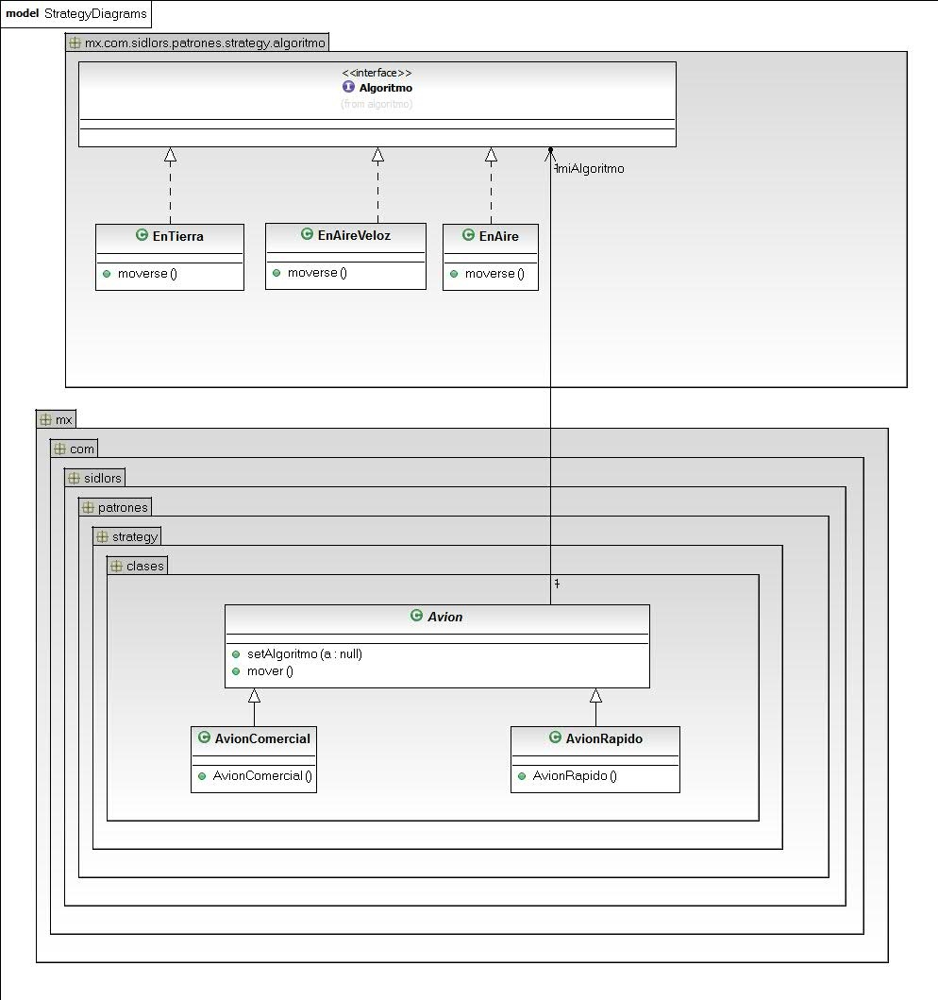

El patrón Estrategia (Strategy) es un patrón de diseño para el desarrollo de software. 
Se clasifica como patrón de comportamiento porque determina cómo se debe realizar el intercambio de mensajes entre 
diferentes objetos para resolver una tarea(delegacion de..). 

El patrón estrategia permite mantener un conjunto de algoritmos encapsulados en grupos de entre los cuales 
el objeto cliente puede elegir aquel que le conviene e intercambiarlo dinámicamente según sus necesidades.

los principios de diseño detras de este patron son:

   1. Identificar los aspectos de la aplicacion cambiantes y separarlos de los posibles objetos cambiantes(propensos a modificaciones)
   2. El diseño a favor de la composicion en vez de la herencia
   3. programar en interfaces no en implementaciones
   

###Diagrama UML

###Participantes

* Contexto (Context) : Es el elemento que usa los algoritmos, por tanto, delega en la jerarquía de estrategias. Configura una estrategia concreta mediante una referencia a la estrategia necesaria. Puede definir una interfaz que permita a la estrategia el acceso a sus datos en caso de que fuese necesario el intercambio de información entre el contexto y la estrategia. En caso de no definir dicha interfaz, el contexto podría pasarse a sí mismo a la estrategia como parámetro.

* Estrategia (Strategy): Declara una interfaz común para todos los algoritmos soportados. Esta interfaz será usada por el contexto para invocar a la estrategia concreta.

* EstrategiaConcreta (ConcreteStrategy): Implementa el algoritmo utilizando la interfaz definida por la estrategia.

##Ejemplo

###Context

En nuestro ejemplo lo que tenemos como contexto es  

* El Objeto Abstracto Avion, que tiene como unico metodo es mover()
* setAlgoritmo con el que se le asocia un algoritmo(estrategia)

Contexto congreto seran en nuestro ejemplo las clases AvionComercial que modela a un avion de uso comercial y
avion Rapido que modela a un avion no comercial que tienen una velocidad endiablada!!

###Strategy

Teneos a la interface Algoritmo que tiene la funcionalidad *moverse()*

###ConcretaEstrategy

tenemos a EnAire, EnAireVeloz y Entierra

###ModeloUML

